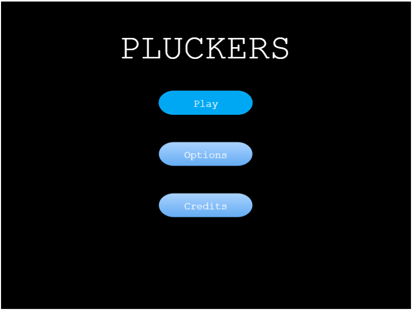
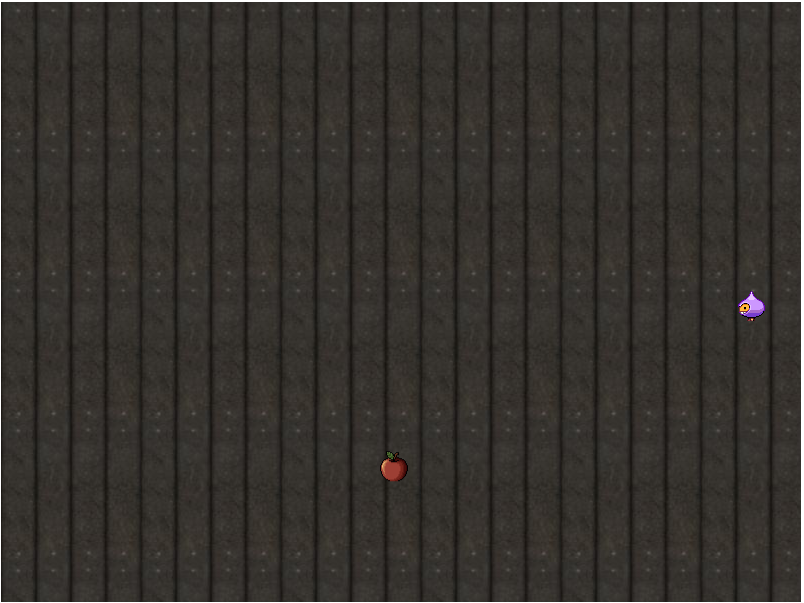

# pluckers

A game built with Html and JavaScript using Phaser 3 game engine.





## Built With

-   HTML5,
-   Javascript,
-   Webpack,
-   Phaser 3

## Live Demo

#### warning this link is currently not working install if it's not at the time of review.

[Live Demo Link](https://dazzling-golick-9877b9.netlify.com/)

## Installation

1. Clone the repository in your local folder.

```
https://github.com/lekegitrepo/pluckers.git
```

2. Run

```
npm install
```

```
npm run dev
```

3. Open index.html in your browser.

## Game Document

[Check here for game document](./game-document/PLUCKERS-GDD.pdf)

## Author

👤 **Temitayo Adeleke**

-   Github: [@lekegitrepo](https://github.com/lekegitrepo)
-   Twitter: [@leketemi](https://twitter.com/leketemi)
-   Linkedin: [linkedin](https://www.linkedin.com/in/adeleke-temitayo-a69125188/)

## 🤝 Contributing

Contributions, issues and feature requests are welcome!

Feel free to check the [issues page](https://github.com/lekegitrepo/pluckers/issues).

## Show your support

Give a ⭐️ if you like this project!

## 📝 License

This project is [MiT](https://opensource.org/licenses/MIT) licensed.

## Credits

-   pngimg.com

-   icons8.com

-   Georges "TRaK" Grondin
